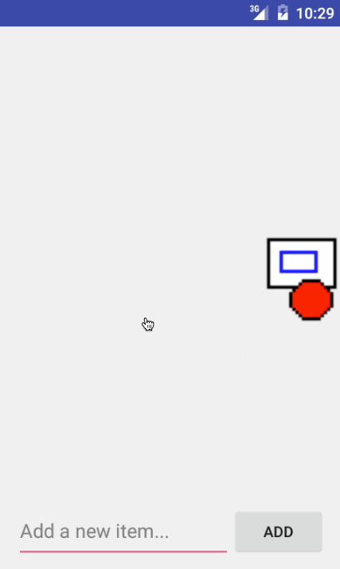

# Todo App Demo

This is an Android demo application for displaying, storing and modifying a Todo list.

Time spent: 2 hours spent in total

Completed user stories:

* [x] Required: Adding an Edit Feature.

Notes:

Following the tutorial as is results in a FileNotFoundException when trying to 
populate the ArrayList with the contents of "todo.txt". I updated the catch block
to initialize an empty ArrayList when "todo.txt" is an empty file.

GIF created with [LiceCap](http://www.cockos.com/licecap/).

